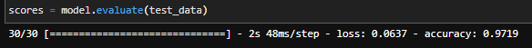
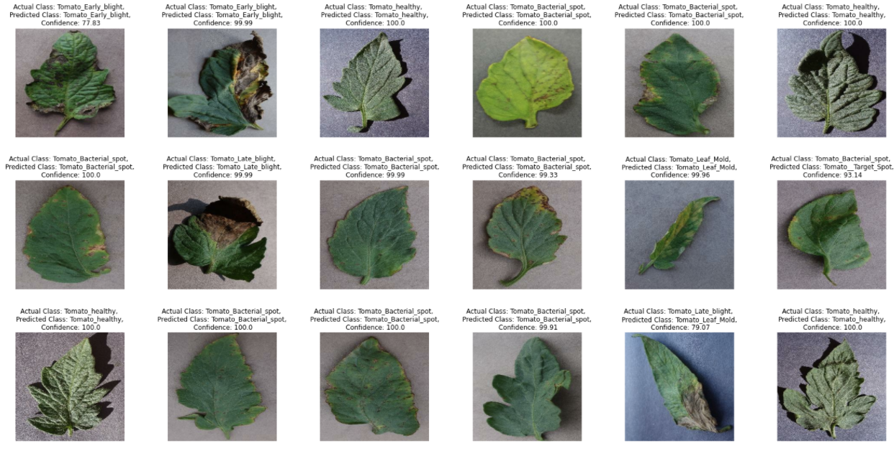
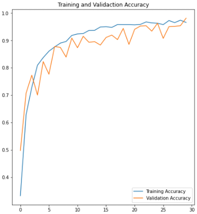
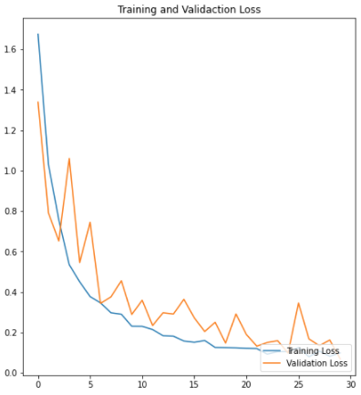

# **Tomato_Disease_Classification**
Credits:https://github.com/codebasics dataset:https://www.kaggle.com/datasets/arjuntejaswi/plant-village
## **Goals**
- Create a **deep learning classification** for the Tomato Dieases dataset, Using the Tensorflow and Keras python packages.
- Create a neutral network using **convolution neural network and pooling** to learn and identify the different diseases in tomatos.
# **Outcome**
Created and trained a machine learn model to predict tomato diseases with **97.19% accuracy.**

# **Final Results**

Shows one batch of pictures with its actual class and the class the model predicted, as well as its confidence on its prediction.

# **Model Results Details**

Below are two graphs showing how the model was trained over its 30 iterations
 
The blue line represents the training the model did compared the orange line is the validation
 
which is what the model used to test its training results on

# **Credits**
*Credit to https://github.com/codebasics 's youtube channel for information on CNN.*
 
*Credit to https://www.kaggle.com/datasets/arjuntejaswi/plant-village for the dataset used.*
